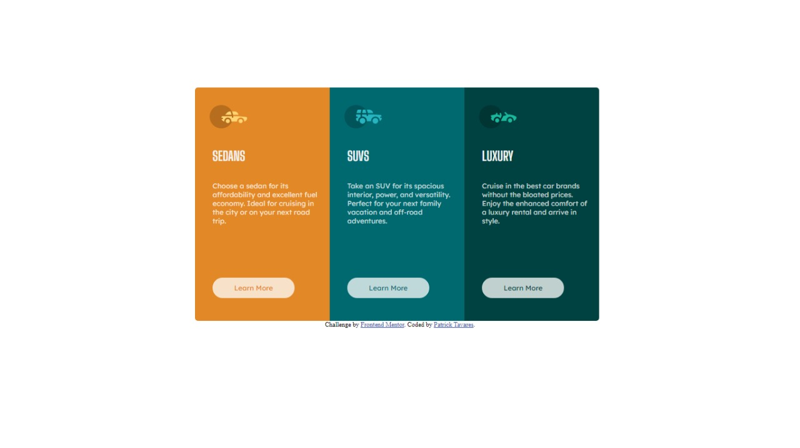
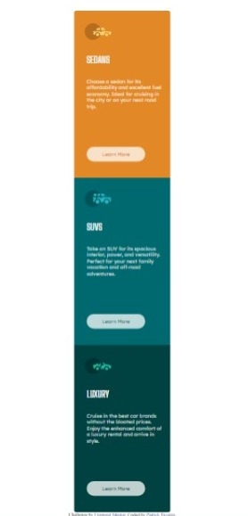

# Frontend Mentor - solução de componente de cartão de visualização de 3 colunas

Esta é uma solução para o desafio do componente do cartão de visualização de 3 colunas no Frontend Mentor. Os desafios do Frontend Mentor ajudam você a melhorar suas habilidades de codificação ao construir projetos realistas.

### O desafio

Os usuários devem ser capazes de:

- Veja o layout ideal, dependendo do tamanho da tela do dispositivo
- Ver estados de foco para elementos interativos

### Screenshot

### Links

- Solution URL: [Add solution URL here](https://your-solution-url.com)
- Live Site URL: [Add live site URL here](https://your-live-site-url.com)

### Construido com

- Semantic HTML5 markup
- CSS custom properties
- Flexbox
- Media Querie

### Continued development
 Estou estudando e focando mais sobre o CSS e como resolver problemas com melhor precisão

## Author

- Frontend Mentor - [@PatrickTav](https://www.frontendmentor.io/profile/PatrickTav)

